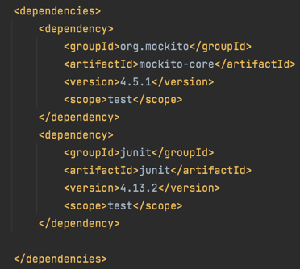
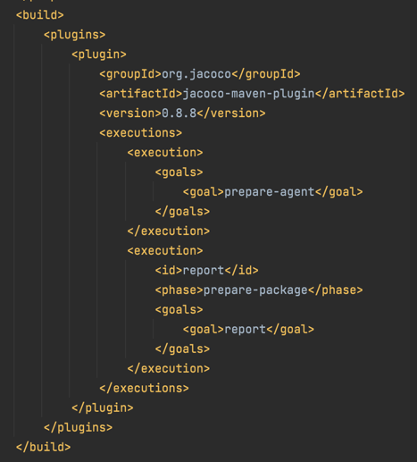
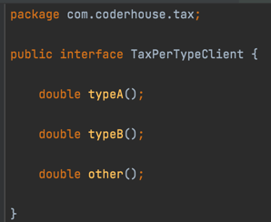
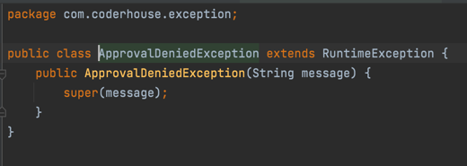
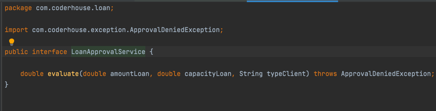
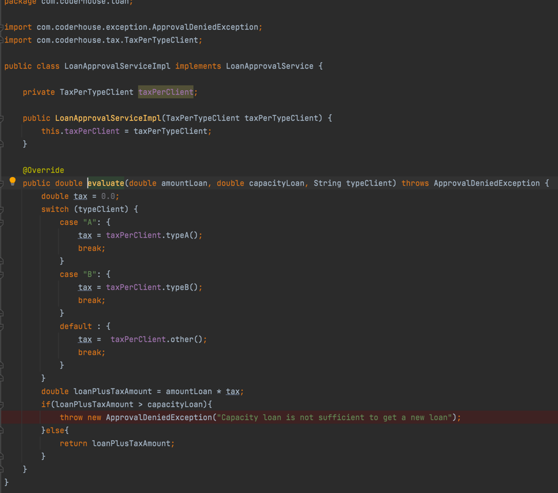
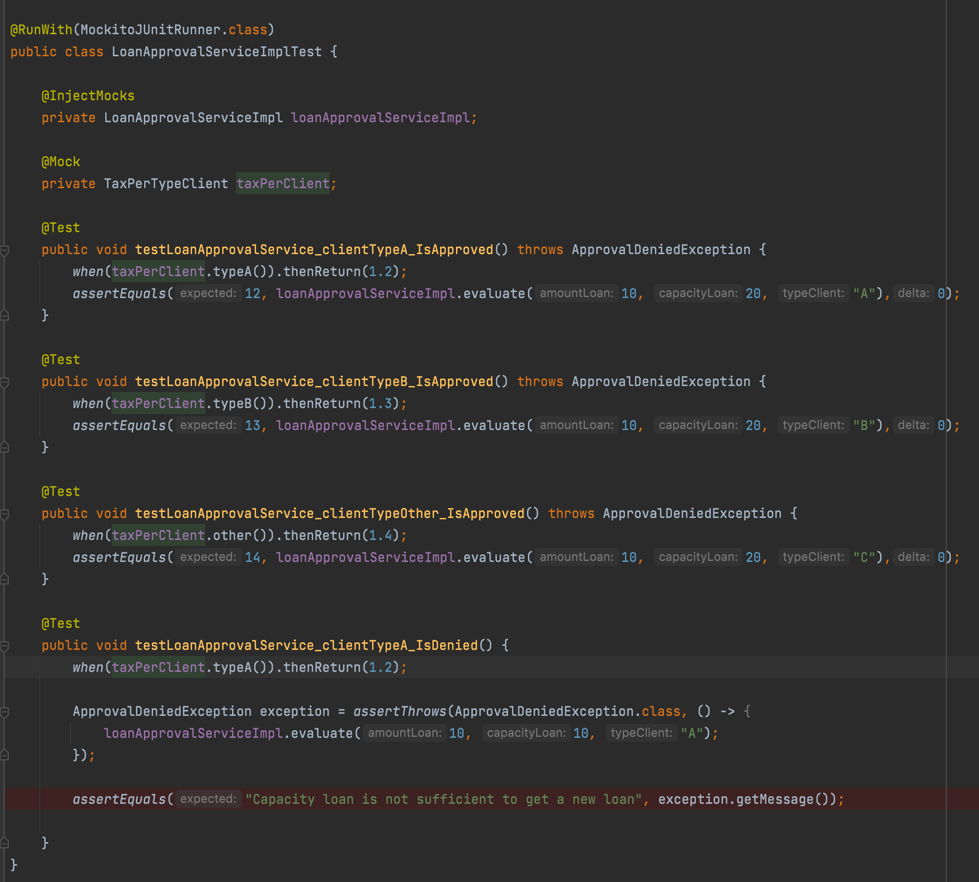

# mockito-class

- Agregar las siguientes dependencias(Junit y mockito) en el archivo pom.xml

- Tambien la configuración de JaCoCo para reporte de test

- Agregar interfaz de Impuesto de clientes

- Agregar clase exception 

- Agregar clase principal e interfaz

- Agregar clase de test

